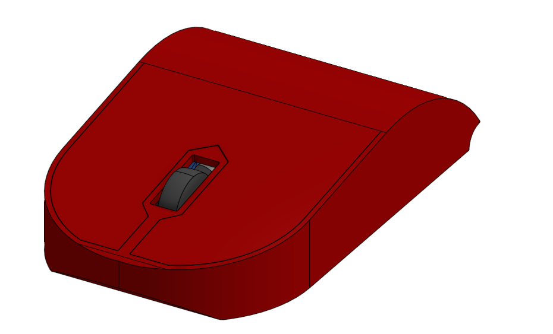

# FreeClick
My first ever mouse - That I made on my own!

Idk if a readme is necessary, but to hell with it! Lets make one anyway!

(Might as well guide you through the info.)

The FreeClick FULL.STEP contains everything required for the mouse itself.

FreeClick CASE.STEP only shows you the case to help the 3d printer guy to print the parts easier.

The Mouse.png is pretty self explanatory, its litirally up there! ^^

And The README.md.. well, You just finished reading it!
